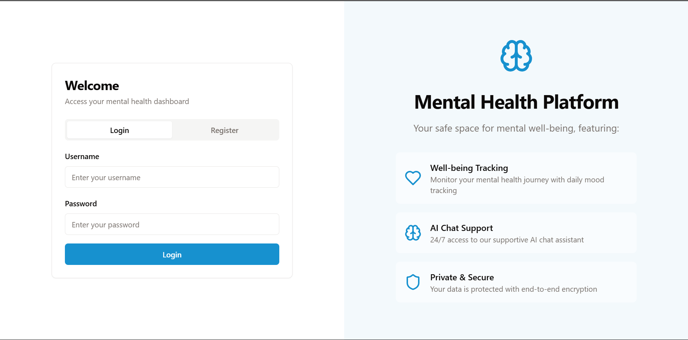
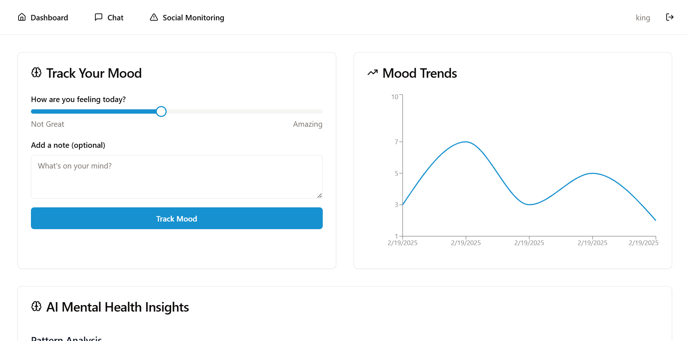
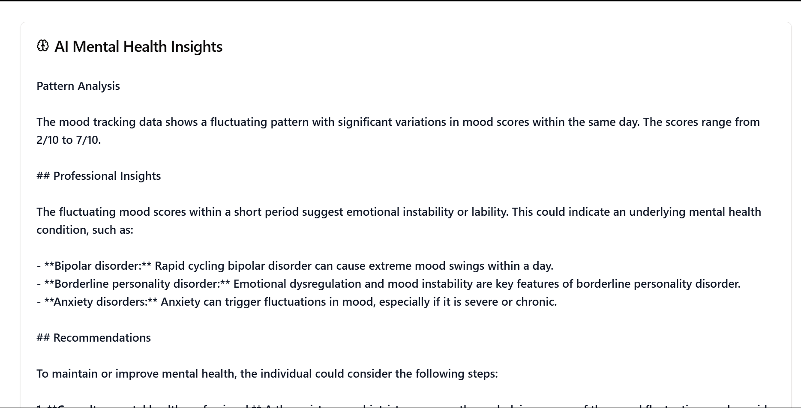
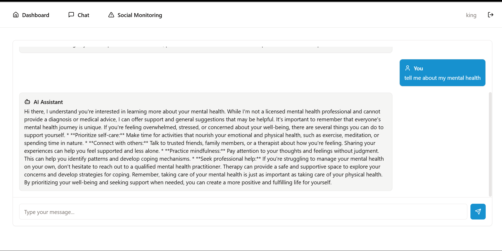
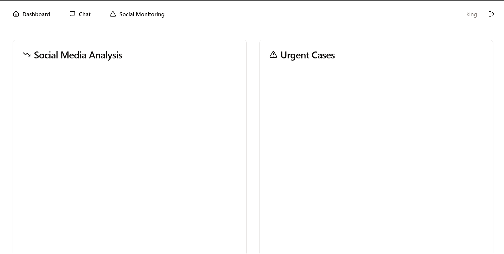

# WellnessBridge

## 🚀 AI-Powered Mental Health & Well-Being Platform

**WellnessBridge** is an AI-driven platform integrating mental health chatbots, employee well-being monitoring, social media distress detection, and personalized therapy AI assistants.



## 🌟 Features

### 🧠 AI-Powered Mental Health Chatbot
- Engages users with NLP-based emotional intelligence.
- Provides therapy-like responses based on mood and intent analysis.
- Suggests coping strategies and mental exercises.
- Supports voice input & sentiment analysis.

### 🏢 Corporate HR Well-Being Monitoring
- AI model analyzes emails, Slack messages, and journal entries for stress levels.
- Generates anonymized weekly well-being reports.
- Alerts HR about burnout or dissatisfaction trends.
- Provides AI-driven mental wellness recommendations.

### 📲 Social Media Analysis for Bullying & Distress Detection
- Scrapes and analyzes posts from Twitter, Reddit, Discord.
- Detects cyberbullying, depression, and suicidal intent.
- Uses GAN-based models for emotional breakdown predictions.
- Alerts trusted contacts or professionals (with user consent).

### 💡 Personalized Therapy AI Assistant
- Uses GAN-BERT for intent classification.
- Matches users with therapists or self-help resources.
- Tracks mood changes over time for adaptive therapy.
- Supports multi-language conversations.

## 🛠 Tech Stack

### Frontend:
- React.js / Next.js (Web UI)
- Flutter (Mobile App)

### Backend:
- FastAPI / Django / Node.js
- PostgreSQL / MongoDB (for structured & unstructured text data)

### AI Models:
- BERT & GAN-BERT for intent detection & chatbots
- LSTMs & GPT models for chatbot responses
- spaCy & NLTK for NER
- RoBERTa & DistilBERT for sentiment analysis
- DualGANs for social media stress prediction

### APIs:
- OpenAI’s GPT API
- Twitter API
- Firebase Authentication

### Security:
- End-to-end encryption for private user data
- Privacy-focused AI ensuring anonymized analytics

## 🚀 Getting Started

### Clone the Repository
```bash
git clone https://github.com/akhiljatoth/WellnessBridge.git
cd WellnessBridge

```




